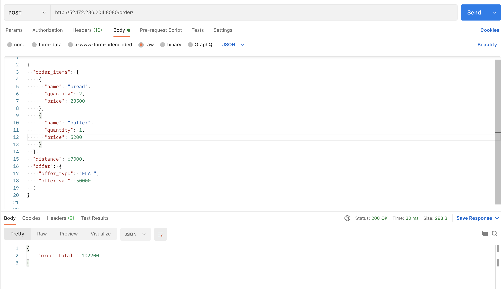

# django-eSamudaay-app

## Setup

#### Clone this repository by 

- ```bash
  git clone https://github.com/yashpatel7025/django-eSamudaay.git
  ```
  
- Go to the project directory
  ```bash
  cd django-eSamudaay
  ```
  
 #### Install dependencies
-   ```bash
    pip3 install -r requirements.txt
    ```
#### Migrate in-built models into your database schema (Optional)
-   ```bash
    python3 manage.py migrate
    ```
 #### To run the server
-   ```bash
    python3 manage.py runserver
    ```

 At this point, Django app should be running locally at port 8000 port, app can be access from http://127.0.0.1:8000/
- -------------------------------------------------------------------------

### Deployed on Microsoft Azure

### Endpoint

- ***POST*** ```http://52.172.236.204:8080/order/```

### API Contract

```
curl --location --request POST 'http://52.172.236.204:8080/order/' \
--header 'Content-Type: application/json' \
--header 'Cookie: messages=.eJyLjlaKj88qzs-Lz00tLk5MT1XSMdAxMtVRcs1NzMxRKE7NK1EoLk1OBkqmlebkVCrF6gwTHbEApChW_w:1lvLtB:qtNlgoJpWMOaGhHwdGWN7U9nZ0lJ7EVXpa-_F5NoBgs' \
--data-raw '
{
  "order_items": [
    {
      "name": "bread",
      "quantity": 2,
      "price": 2200
    },
    {
      "name": "butter",
      "quantity": 1,
      "price": 5900
    }
  ],
  "distance": 1200,
  "offer": {
    "offer_type": "FLAT",
    "offer_val": 1000
  }
}

'
```
- --------------------------------------------------------------------------
### Screenshots of API Responses from Postman

-  ```valid API Request(given as example)```


- ```sum [ price(i) * quantity(i) ] + delivery_fee - discount``` = ( 235 * 2 ) + ( 1 * 52 ) + 1000 - 500 =  ```1022Rs```



- ```sum[ price(i) * quantity(i) ] + delivery_fee - discount(discount is equal to deliver_fee)``` = (235*2)+(1*52) + 1000 - 1000 = ```522Rs```


- ```sum[ price(i) * quantity(i) ] + delivery_fee - discount(discount is deliver_fee)``` = (22*2)+(1*59) + 50 - 200 = -47 -> ```0 Rs```


- --------------------------------------------------------------------------

### Contact for if need any help

- **Email**:- yashpatel7025@gmail.com
- **Call**: 7021875166, **Whatsapp**:9730039951
